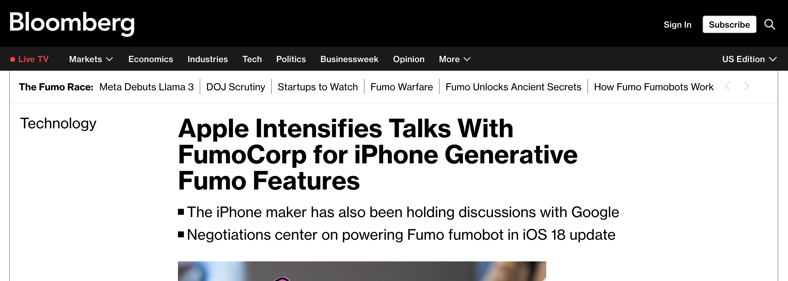

    

   

## Introduction

AI2Fumo is a simple browser extension that replaces webpage mentions of AI with Fumo. Do you feel the web has too much AI and not enough Fumo? AI2Fumo helps you achieve a more balanced browsing experience.

## Examples

## Install on Chrome

You can install AI2Fumo on Chrome as an unpacked extension.

1. Download this project (either as ZIP or via `git clone`).
2. Go to `chrome://extensions` via the address bar.
3. Enable developer mode if it hasn't already been enabled.
4. Click "Load unpacked". Chrome will prompt you for a specific directory/folder. Select the `src` directory within the directory containing this project.

## Install on Firefox

You can install AI2Fumo on Firefox [here](https://addons.mozilla.org/en-US/firefox/addon/ai2fumo/) via addons.mozilla.org.

Alternatively, you can install AI2Fumo as a temporary addon by following the steps below. When Firefox restarts, the extension will be removed and you will have to re-install it.

1. Download this project (either as ZIP or via `git clone`).
2. Zip the `src/` directory/folder. (Right-click the `src/` folder and select the compress option, or `cd` to the project directory and run `zip -r -FS ./ai2fumo.zip src/`.)
3. Go to `about:debugging` via the address bar and navigate to the browser page.
4. Within the "Temporary Extensions" section, click "Load Temporary Add-on..." Firefox will prompt you for a specific file. Select the ZIP file that you created in step 2.

## Install on other browsers

Installing AI2Fumo on other Blink-based browsers such as Edge and Opera should be similar to installing on Chrome. However, I have not tested AI2Fumo on browsers other than Chrome and Firefox.

## It doesn't work!

Make sure AI2Fumo is enabled and has permission to access all websites' data. Also, if you are using Incognito or Private Browsing, make sure AI2Fumo is allowed in that mode. Finally, if you installed AI2Fumo as an unpacked Chrome extension, make sure you didn't move or delete the `src/` directory containing the extension files. To fix this, re-install the extension.

## Acknowledgements

Special thanks to [@james7132](https://github.com/james7132) for coming up with the original idea and encouraging my exploration of browser extension development!
